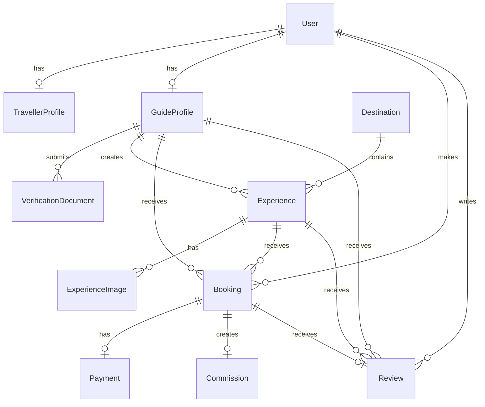

# Database Foundation

This document describes the Phase 1 PostgreSQL foundation for My South African Guide. The schema is defined in [../prisma/schema.prisma](../prisma/schema.prisma) and is intended to be accessed only from server-side repositories and services.

## Database Decisions

- **PostgreSQL** is the system of record for users, marketplace content, booking state, reviews, payment records, and commissions.
- **Prisma ORM** provides the typed schema/client boundary and migration workflow.
- IDs use Prisma `cuid()` values so public identifiers are not sequential database integers.
- Money is stored as integer minor units in `price`, `totalAmount`, `amount`, and commission `amount`, with a three-letter currency code beside it. This avoids floating-point currency errors.
- `duration` is stored as minutes so filtering and availability calculations do not depend on display strings.
- Guide verification, experience publication, booking, payment, and commission states are explicit enums rather than free-form strings.
- Public guide profile data is separate from `VerificationDocument`, which stores only a private object-storage reference rather than document contents or public files.
- Booking prices and currency are stored on the booking/payment/commission records so financial history remains stable when an experience price changes.
- Foreign keys use restrictive deletes for financial and marketplace history. Profile-owned records and experience images cascade when their parent is intentionally deleted.
- Slugs are unique for destinations and experiences. Listing and workflow indexes support guide moderation, published content, booking dates, and status queries.

## Entity Relationships



### User and profiles

`User` owns the identity-level fields and role. `TravellerProfile` and `GuideProfile` are optional one-to-one extensions, allowing an authenticated user to be represented without placing every role-specific field on the identity record. The application must enforce that a `GUIDE` user has an appropriate guide profile before guide workflows are available.

### Guide verification

`GuideProfile.verificationStatus` is the aggregate onboarding state. The current enum preserves the existing workflow states:

```text
DRAFT -> SUBMITTED -> UNDER_REVIEW -> APPROVED
                         |             |
                         v             v
                      REJECTED      SUSPENDED
```

`VerificationDocument` stores document type, a private storage reference, review status, and timestamps. The MVP migration renames the legacy `documentUrl` column to `storageReference` so existing references are preserved. The value is a private object-storage key/path, not a public URL and not document contents.

### Experiences and destinations

An approved and active guide can own many experiences. Each experience belongs to one destination and can have ordered images. `Experience.status` controls whether it is visible in public search; only `ACTIVE` records should be exposed publicly. Destinations have their own publication status.

### Bookings, payments, reviews, and commission

`Booking` is the central request/transaction record. It references the traveller, guide, and experience directly so historical ownership and reporting remain stable. The MVP request lifecycle is represented by `REQUESTED`, `ACCEPTED`, `DECLINED`, `CONFIRMED`, `COMPLETED`, and `CANCELLED`; payment-related states remain available for a later payment phase. `Payment`, `Commission`, and `Review` are one-to-one with a booking in this initial foundation.

`Review.status` separates a submitted review from a published review. The unique booking relation prevents more than one review for the same booking; the application must additionally require a completed booking and ownership by the traveller before accepting a review.

The application should add a `BookingEvent` history table before booking workflows are implemented. A single current status is useful for queries, but an immutable transition history is required for support, disputes, refunds, and auditability.

## Migration and Implementation Notes

1. Use `.env.local` for the local `DATABASE_URL` and Docker PostgreSQL credentials.
2. Apply committed migrations with `npx prisma migrate deploy` and generate Prisma Client with `npx prisma generate`.
3. Add seed data that maps the current static content in `src/data/site.ts` to destinations, guides, and experiences. Keep the current UI view models separate from Prisma records.
4. Add repository/service boundaries under `src/server` before importing Prisma into a route or component.
5. Add runtime validation for all writes and environment variables before authenticated mutations are introduced.
6. Add `BookingEvent`, `Availability`, `Favourite`, `MessageThread`, `Message`, `AuditLog`, and payout-related models only when those workflows are designed.
7. Add reviewer/admin foreign keys to verification documents, document expiry, and audit metadata before production moderation.
8. Add stronger currency constraints or a currency reference table if supported currencies expand beyond the initial marketplace set.
9. Configure backups, point-in-time recovery, migration checks in CI, and separate development/staging/production databases before launch.

## Security and Privacy Notes

- Do not commit `.env`; `.env.example` contains placeholders only.
- Database credentials must remain server-only and must not be exposed to client components.
- Store verification documents in private object storage with short-lived signed URLs.
- Do not store raw card data. Payment providers should own card data and communicate through verified, idempotent webhooks.
- Add authorization checks before exposing profile, booking, payment, or document records.
- POPIA requirements such as consent, retention, data access/deletion, breach response, and lawful processing need product/legal implementation in addition to this schema.

## Deliberately Deferred Models

- `BookingEvent`: useful for an auditable status history, but not required until booking mutations exist.
- `Availability`: phase 2; the MVP records a requested date without claiming live availability.
- `Favourite`: phase 2 traveller account functionality.
- `MessageThread` and `Message`: phase 2 guide/traveller messaging.
- `Notification`: phase 2 email and in-app notification delivery.
- `AuditLog`: required before admin moderation and financial overrides are introduced.
- `Payout`: required when payment and guide settlement workflows are designed.

## Current Scope

This phase creates the database contract only. It deliberately does not add authentication, APIs, server actions, migrations against a live database, seed scripts, UI, payment integrations, or dashboards.