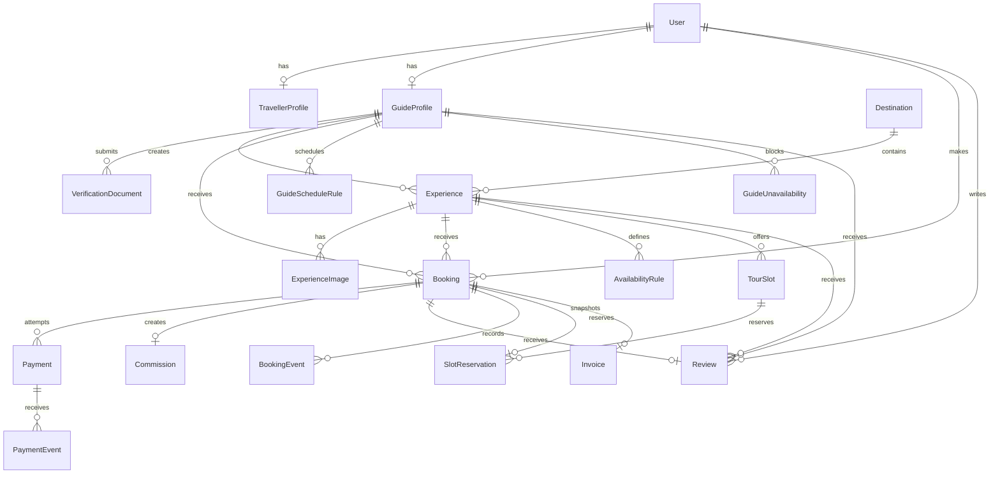

# Database Foundation

This document describes the Phase 1 PostgreSQL foundation for My South African Guide. The schema is defined in [../prisma/schema.prisma](../prisma/schema.prisma) and is intended to be accessed only from server-side repositories and services.

## Database Decisions

- **PostgreSQL** is the system of record for users, marketplace content, booking state, reviews, payment records, and commissions.
- **Prisma ORM** provides the typed schema/client boundary and migration workflow.
- IDs use Prisma `cuid()` values so public identifiers are not sequential database integers.
- Money is stored as integer minor units in `price`, `totalAmount`, `amount`, and commission `amount`, with a three-letter currency code beside it. This avoids floating-point currency errors.
- `duration` is stored as minutes so filtering and availability calculations do not depend on display strings.
- Guide verification, experience publication, booking, payment, and commission states are explicit enums rather than free-form strings.
- Public guide profile data is separate from `VerificationDocument`, which stores only a private object-storage reference rather than document contents or public files.
- Booking prices and currency are stored on the booking/payment/commission records so financial history remains stable when an experience price changes.
- Foreign keys use restrictive deletes for financial and marketplace history. Profile-owned records and experience images cascade when their parent is intentionally deleted.
- Slugs are unique for destinations and experiences. Listing and workflow indexes support guide moderation, published content, booking dates, and status queries.

## Entity Relationships


```mermaid
erDiagram
  User ||--o| TravellerProfile : has
  User ||--o| GuideProfile : has
  GuideProfile ||--o{ VerificationDocument : submits
  GuideProfile ||--o{ Experience : creates
  Destination ||--o{ Experience : contains
  Experience ||--o{ ExperienceImage : has
  User ||--o{ Booking : makes
  GuideProfile ||--o{ Booking : receives
  Experience ||--o{ Booking : receives
  Booking ||--o{ Payment : attempts
  Booking ||--o| Commission : creates
  Booking ||--o| Review : receives
  Booking ||--o{ BookingEvent : records
  Booking ||--o| SlotReservation : reserves
  Booking ||--o| Invoice : snapshots
  Experience ||--o{ AvailabilityRule : defines
  Experience ||--o{ TourSlot : offers
  TourSlot ||--o{ SlotReservation : reserves
  GuideProfile ||--o{ GuideScheduleRule : schedules
  GuideProfile ||--o{ GuideUnavailability : blocks
  Payment ||--o{ PaymentEvent : receives
  User ||--o{ Review : writes
  GuideProfile ||--o{ Review : receives
  Experience ||--o{ Review : receives
```

### User and profiles

`User` owns the identity-level fields and role. `TravellerProfile` and `GuideProfile` are optional one-to-one extensions, allowing an authenticated user to be represented without placing every role-specific field on the identity record. The application must enforce that a `GUIDE` user has an appropriate guide profile before guide workflows are available.

### Guide verification

`GuideProfile.verificationStatus` is the aggregate onboarding state. The current enum preserves the existing workflow states:

```text
DRAFT -> SUBMITTED -> UNDER_REVIEW -> APPROVED
                         |             |
                         v             v
                      REJECTED      SUSPENDED
```

`VerificationDocument` stores document type, a private storage reference, review status, and timestamps. The MVP migration renames the legacy `documentUrl` column to `storageReference` so existing references are preserved. The value is a private object-storage key/path, not a public URL and not document contents.

### Experiences and destinations

An approved and active guide can own many experiences. Each experience belongs to one destination and can have ordered images. `Experience.status` controls whether it is visible in public search; only `ACTIVE` records should be exposed publicly. Destinations have their own publication status.

### Bookings, payments, reviews, and commission

`Booking` is the central request/transaction record. It references the traveller, guide, and experience directly so historical ownership and reporting remain stable. Its existing lifecycle is unchanged. `Payment` is one-to-many with a booking so later retries remain distinct attempts; `Commission` and `Review` remain one-to-one. `Invoice` is a separate financial snapshot, and its issuer details, tax treatment, and legal requirements remain undecided.

### Booking time compatibility

`Booking.bookingDate` is a legacy compatibility field, not the authoritative scheduled instant. The current booking request schema requires it; booking creation persists it, duplicate detection compares it, and booking DTOs return it. Its PostgreSQL type is `timestamp without time zone`. The API parses an input string into a JavaScript `Date`, but the field stores no timezone identifier or original offset. Do not infer a timezone from historical `bookingDate` values or backfill the scheduling fields from them.

`Booking.startsAt` and `Booking.endsAt` are nullable because the current request workflow creates bookings without concrete scheduled instants. No current booking service writes them. Once a later scheduling workflow supplies a concrete time, these fields are the authoritative start and end instants and must be stored with PostgreSQL `timestamptz`; `Booking.timezone` carries the applicable IANA timezone identifier for local scheduling/display context. Set both instants together and provide an IANA timezone when they are used. Do not use `bookingDate` as a second scheduling authority or silently derive it from these instants. Retain the legacy field and API contract until a separately planned application migration changes all consumers.

The three existing local bookings have `bookingDate` wall times of 09:00, while `startsAt`, `endsAt`, and booking, experience, and guide timezone fields are null. Their historical timezone cannot be established from the stored data. Their values remain unchanged; the ambiguity must be resolved only from independent evidence, not by assuming a South African timezone.

`Review.status` separates a submitted review from a published review. The unique booking relation prevents more than one review for the same booking; the application must additionally require a completed booking and ownership by the traveller before accepting a review.

`BookingEvent` is an immutable lifecycle-audit foundation. Event emission is not implemented in this phase. `PaymentEvent` has provider-scoped event identity for future idempotent webhook processing; no webhook or payment integration is implemented.

Optional invoice customer snapshot fields are schema-only in this phase. No billing address, VAT number, or other additional customer information is collected or populated; confirm legal and POPIA requirements before future invoice workflows use them.

The initial local Phase 1 migration had already added zero/false defaults to booking fee, discount, VAT amount, and private-tour fields. The follow-up removes those defaults and makes the fields nullable for future writes, but preserves existing values. Treat those legacy values as unverified until the pricing and tax decisions are confirmed; no data was rewritten by the follow-up.

`AvailabilityRule` stores recurring local wall-clock rules associated with an experience. `TourSlot` stores concrete UTC instants with an IANA timezone identifier, capacity, and seat counters. `SlotReservation` is the future booking-to-capacity commitment. PostgreSQL checks keep capacity counters within bounds, and a GiST exclusion constraint prevents overlapping non-cancelled slots assigned to the same guide. These structures do not calculate availability or reserve capacity yet; a later transactional service must atomically coordinate reservation rows and seat counters to prevent overbooking.

`GuideScheduleRule` stores recurring local wall-clock hours, while `GuideUnavailability` stores UTC exception windows. Timezone identifiers are retained on guides and experiences; UTC instants are stored for concrete event times. The application must resolve local schedule times using the applicable IANA timezone and explicit daylight-saving behavior before generating slots. Conflict detection against guide leave and schedule rules remains future service work.

### Phase 2 implementation gates

The current schema is a foundation, not yet a complete availability/reservation contract. Resolve these points before adding Phase 2 services or endpoints:

- Define how a slot-based booking preserves the required legacy `Booking.bookingDate` API/write contract without making it a second scheduling authority.
- Approve the hold duration and its configuration source. No booking hold-duration setting currently exists.
- Define how `HELD`, `PENDING_PAYMENT`, and `COMMITTED` reservations relate to `REQUESTED`, `ACCEPTED`, and `CONFIRMED` bookings. Do not infer confirmation or expiry policy from the enums alone.
- Define who may create and change slots and schedules. Existing authentication has roles, but there are no schedule/slot management routes or corresponding authorization policy.
- Define availability exception precedence and how blocked dates, special departures, and capacity overrides interact with concrete slots.
- Require the appropriate experience/guide IANA timezone and decide daylight-saving gap/overlap handling before interpreting recurring local rules. Current local experience/guide timezone fields are unset, and historical booking times must not be used to infer them.
- Define standard versus private-group capacity behavior and any relationship to `Experience.groupLimit`; do not treat display copy such as “Private group” as a capacity policy.
- Design idempotent reservation requests and transactional booking-event creation together. `SlotReservation` currently has no request idempotency key or traveller relation, while `BookingEvent` requires an existing booking and `BookingEventType` has no reservation-specific event types.

The current local database has no availability rules, exceptions, slots, reservations, guide schedules, unavailability windows, or booking events. Do not manufacture schedules or migrate the existing bookings into slots to unblock implementation.

## Migration and Implementation Notes

1. Use `.env.local` for the local `DATABASE_URL` and Docker PostgreSQL credentials.
2. Apply committed migrations with `npx prisma migrate deploy` and generate Prisma Client with `npx prisma generate`.
3. Add seed data that maps the current static content in `src/data/site.ts` to destinations, guides, and experiences. Keep the current UI view models separate from Prisma records.
4. Add repository/service boundaries under `src/server` before importing Prisma into a route or component.
5. Add runtime validation for all writes and environment variables before authenticated mutations are introduced.
6. Add `Favourite`, `MessageThread`, `Message`, `AuditLog`, and payout-related models only when those workflows are designed.
7. Add reviewer/admin foreign keys to verification documents, document expiry, and audit metadata before production moderation.
8. Add stronger currency constraints or a currency reference table if supported currencies expand beyond the initial marketplace set.
9. Configure backups, point-in-time recovery, migration checks in CI, and separate development/staging/production databases before launch.
10. Treat the Phase 1 migrations as forward-only by default. Before any rollback, stop writes and take a database snapshot. The uniqueness changes can only be reversed after confirming there is at most one payment per booking and no provider-event ID collisions; timestamp columns must be converted back with an explicit UTC interpretation. Remove the Phase 1 checks/indexes only after reviewing dependent data. Do not use `migrate reset` as a rollback strategy.

## Security and Privacy Notes

- Do not commit `.env`; `.env.example` contains placeholders only.
- Database credentials must remain server-only and must not be exposed to client components.
- Store verification documents in private object storage with short-lived signed URLs.
- Do not store raw card data. Payment providers should own card data and communicate through verified, idempotent webhooks.
- Add authorization checks before exposing profile, booking, payment, or document records.
- POPIA requirements such as consent, retention, data access/deletion, breach response, and lawful processing need product/legal implementation in addition to this schema.

## Deliberately Deferred Models

- `Favourite`: phase 2 traveller account functionality.
- `MessageThread` and `Message`: phase 2 guide/traveller messaging.
- `Notification`: phase 2 email and in-app notification delivery.
- `AuditLog`: required before admin moderation and financial overrides are introduced.
- `Payout`: required when payment and guide settlement workflows are designed.

## Unresolved Business Decisions

- VAT treatment, invoice issuer/legal details, and invoice numbering policy.
- Per-person versus fixed-tour pricing, private-guide pricing, and guide assignment.
- Payment provider, full payment versus deposit, and payment-attempt/hold durations.
- Cancellation, refund, commission, and instant-booking versus guide-approval rules.
- Timezone display policy and daylight-saving handling for recurring local schedules.
- POPIA consent, retention, and deletion policy.

## Current Scope

The Prisma seed command (`pnpm db:seed`) idempotently upserts the current demo destinations, guides, and assigned experiences. It uses reserved `example.invalid` guide email addresses and does not assign passwords. The Greater Kruger destination is included for the existing Kruger experience; the Winelands experience is excluded until a guide is assigned in the catalog. Seed data leaves unknown experience timezone, pricing model, and group capacity unset. It does not create tour slots because no authoritative availability schedule or capacity has been configured, and it never deletes or changes bookings, payments, reservations, or existing tour slots.

The seed command is reference-data setup, not a production data migration. Availability and reservation workflows remain separate from it; payment integrations/webhooks and invoice generation are not seeded.