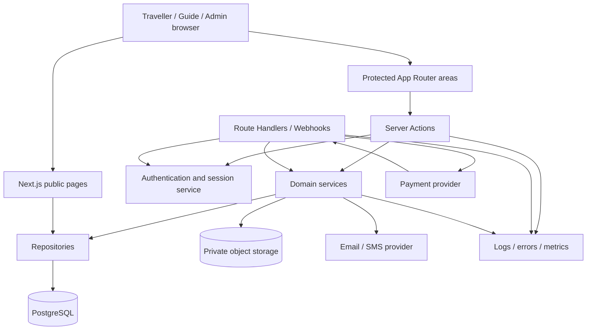

# My South African Guide: Architecture Review

**Review date:** 2026-09-16  
**Scope:** Current Next.js public website foundation only  
**Recommendation:** Keep the current public-facing foundation, but establish a domain/data boundary before implementing accounts, guide onboarding, bookings, or payments.

## Executive Assessment

The project is a valid App Router proof of concept for a premium public marketplace website. It has a strong visual foundation, a small and understandable route tree, strict TypeScript enabled, typed content collections, optimized `next/image` usage, and a successful production build.

It is not yet a marketplace application architecture. The current system is static presentation code with no persistence, authentication, authorization, validation, API boundary, observability, or transactional model. That is appropriate for the completed marketing phase, but the next implementation should not continue adding product behavior directly to the current static content modules.

### Priority findings

1. **High: No application/domain/data layer exists.** Content is hard-coded in `src/data/site.ts`; there is no repository, database schema, service layer, validation layer, or API contract.
2. **High: The public detail routes are placeholders.** Dynamic `[slug]` routes do not read the slug, use `generateStaticParams`, load a record, return `notFound()`, or generate route-specific metadata.
3. **High: Authentication and authorization are entirely absent.** There is no identity provider, session model, role enforcement, server-side authorization, or admin boundary.
4. **High: Booking and payment safety boundaries do not exist.** No booking state machine, idempotency, webhook verification, payment ledger, or server-side price calculation is present.
5. **Medium: `src/components/marketplace.tsx` is a broad client boundary.** Because it begins with `"use client"`, all exports in that module, including static card/footer components, are pulled behind a client boundary. Split interactive components from server-renderable components before the marketplace grows.
6. **Medium: Remote image URLs are content dependencies.** `next.config.ts` allows Unsplash, but the source still contains stale/broken remote references in secondary-page content. Production content should use a managed asset strategy with validation and fallbacks.
7. **Medium: The original shadcn/ui requirement is not represented in the dependency tree.** The current UI is Tailwind plus custom components and Lucide. That is workable, but the team should explicitly choose whether to adopt shadcn primitives or document the custom design-system decision.

## Current Architecture

### Folder structure

```text
src/
  app/
    page.tsx
    layout.tsx
    globals.css
    about/page.tsx
    become-guide/page.tsx
    contact/page.tsx
    destinations/page.tsx
    destinations/[slug]/page.tsx
    experiences/page.tsx
    experiences/[slug]/page.tsx
    guides/page.tsx
    guides/[slug]/page.tsx
    transport/page.tsx
  components/
    marketplace.tsx
    secondary-page.tsx
  data/
    site.ts
public/
```

This is acceptable for a small public site. It is not yet feature-oriented. As soon as authenticated workflows arrive, organize by domain rather than placing every UI primitive in a single general-purpose file:

```text
src/
  app/
    (public)/...
    (account)/...
    (guide)/...
    (admin)/...
    api/...
  components/
    ui/                 # low-level design primitives
    layout/             # navbar, footer, shells
  features/
    experiences/
    guides/
    bookings/
    reviews/
    payments/
  server/
    auth/
    db/
    repositories/
    services/
    validations/
  lib/
    env.ts
    ids.ts
    money.ts
    dates.ts
```

Do not move everything immediately. Introduce these boundaries when the first domain workflow is built, starting with `guides` and `experiences`.

### Next.js App Router

**Strengths**

- `src/app` and nested route segments are used correctly.
- Root metadata is defined in `layout.tsx`.
- Dynamic route folders exist for guides, experiences, and destinations.
- `next/image` and `next/font` are used.
- The project builds successfully under Next 16.3.5.

**Risks and improvements**

- Dynamic pages currently ignore `params`; they should resolve a slug through a server-side repository, call `notFound()` for missing records, and expose `generateMetadata` based on the loaded record.
- The current route files are thin wrappers over generic placeholder content. That is fine for a visual prototype but must not become the domain model.
- Add route groups for public, account, guide, and admin surfaces before protected workflows are introduced.
- Add `loading.tsx`, `error.tsx`, and `not-found.tsx` at appropriate route boundaries once data fetching is introduced.
- Add `sitemap.ts`, `robots.ts`, canonical URLs, Open Graph images, and structured data for experiences, guides, destinations, and organization metadata.
- Use `generateStaticParams` only for stable editorial content. Marketplace inventory should generally be server-rendered or revalidated from a data source.

### Server/client separation

The homepage and page shells are server components by default, but `marketplace.tsx` is marked `"use client"` for the mobile navbar and Framer Motion reveal. This makes every export in the file client-side, including `ExperienceCard`, `GuideCard`, `Footer`, `SectionHeading`, and `SearchBox`.

Recommended split:

- Server components: `ExperienceCard`, `GuideCard`, `SectionHeading`, `Footer`, static hero, static page sections.
- Client components: `MobileNav`, `SearchBox` when interactive, `FadeIn` or a small motion wrapper.
- Server actions/API: search, guide onboarding, booking requests, favourites, review submission.

This will reduce client JavaScript and preserve server-side rendering for content-heavy marketplace pages.

## TypeScript Review

**Strengths**

- `strict: true` is enabled.
- The project uses path aliases and typed component props.
- `Experience` and `Guide` types provide a useful starting point.
- The production build completes TypeScript successfully.

**Gaps**

- The current types are UI-card types, not domain types. For example, `price`, `rating`, and `reviews` are formatted strings. Domain models should use numeric money in minor units, decimal-safe rating values, and integer review counts.
- The data types are compressed into one-line declarations and should become readable interfaces or type aliases in domain modules.
- No shared `Slug`, `Currency`, `ISODate`, `ProvinceCode`, or branded ID types exist.
- No discriminated unions exist for user roles, booking status, payment status, or verification status.
- No runtime validation exists. Add Zod schemas at external boundaries: forms, route handlers, server actions, webhook payloads, and environment variables.
- Dynamic page props should model the current Next.js params contract and use the slug.

Example domain concepts to establish later:

```ts
type UserRole = "traveller" | "guide" | "admin";
type BookingStatus = "requested" | "confirmed" | "cancelled" | "completed";
type VerificationStatus = "pending" | "approved" | "rejected";

type Money = {
  amountMinor: number;
  currency: "ZAR" | "USD" | "EUR" | "GBP";
};
```

## Component Architecture

The reusable component instinct is good, but responsibilities are currently too broad:

- `marketplace.tsx` contains navigation, search, cards, section headings, animation, badges, and footer in one client module.
- `secondary-page.tsx` mixes page composition, hero presentation, destination listing, and detail-page copy.
- Many components are dense one-line JSX expressions, which raises maintenance and accessibility risk.
- `SectionHeading` hard-codes every action link to `/experiences`, which is incorrect for destinations and guides.
- Footer links currently point to `/` rather than their actual destinations.
- The search control is visual only: it has no form, inputs, URL state, validation, or result behavior.
- The static page detail components repeat generic copy instead of receiving domain records.

Recommended component layers:

1. `components/ui`: Button, Badge, IconButton, Field, Card, Dialog, Tabs.
2. `components/layout`: Navbar, Footer, PageHero, PageContainer.
3. `features/experiences/components`: ExperienceCard, ExperienceGrid, ExperienceFilters, ExperienceDetail.
4. `features/guides/components`: GuideCard, GuideFilters, GuideProfile.
5. `features/bookings/components`: BookingSummary, AvailabilityPicker, BookingStatus.
6. `features/*/server`: data access and server actions, never imported by client components.

The visual language is coherent. Preserve the current color tokens and typography, then formalize them in shared primitives rather than adding ad hoc utility strings to every feature.

## Performance and Core Web Vitals

**Current strengths**

- `next/image` is used with `fill`, `sizes`, and `priority` for hero imagery.
- Static routes can be prerendered.
- The UI has limited animation and uses viewport-triggered reveals.
- The page uses `next/font` for self-hosted font optimization.

**Risks**

- Several large remote Unsplash images are requested at high widths. Production should use curated, resized assets or an image CDN with explicit width/quality policy.
- Multiple `priority` images on route heroes can compete for LCP when navigating to secondary pages. Use priority only for the single above-the-fold image per route.
- The broad client component increases JavaScript shipped to mobile browsers.
- Framer Motion should remain isolated to small wrappers; do not make content grids client-rendered only for animation.
- No performance budget, Lighthouse CI, bundle analysis, or real-device testing is configured.
- Remote image availability is not guaranteed. A broken URL has already appeared in secondary-page content.

Before marketplace launch, measure LCP, CLS, INP, total JS, image transfer size, and route-level cache behavior on a throttled mobile profile.

## SEO and Accessibility

The root title and description are a good start, but route metadata is currently shallow. Add:

- `metadataBase`, canonical URLs, Open Graph and Twitter metadata.
- Dynamic metadata from guide, experience, and destination records.
- JSON-LD for Organization, TouristAttraction, Product/Offer where appropriate, and BreadcrumbList.
- Sitemap and robots files.
- Stable, descriptive image alt text from content records.
- `aria-current` for active navigation, visible focus states, and keyboard testing.
- Real form labels and error messages for search and future onboarding forms.
- Reduced-motion handling for the motion wrapper.
- Correct heading hierarchy on listing and detail pages.

## Security and POPIA Readiness

There is currently no server-side security surface, which means there is also no security control to review yet. Before collecting traveller or guide data:

- Use a managed authentication provider or a well-maintained auth library with secure, HTTP-only, same-site cookies.
- Enforce authorization on the server for every guide, traveller, and admin mutation. Never rely on hidden UI or client role state.
- Define a role/permission matrix and audit admin actions.
- Validate and normalize all user input server-side with schemas.
- Keep payment provider secrets, database credentials, and signing keys server-only.
- Verify payment webhooks using provider signatures and make handlers idempotent.
- Store document uploads outside the public folder using private object storage and short-lived signed URLs.
- Encrypt sensitive data at rest where appropriate, minimize retention, and avoid storing raw card data.
- Add consent, privacy notice, data access/correction/deletion workflows, retention rules, and breach response procedures for POPIA.
- Log security-relevant events without logging passwords, tokens, payment details, or unnecessary personal information.
- Add rate limiting, abuse protection, CSRF protection where cookie-authenticated mutations require it, and bot protection for public forms.

A legal review is required before launch; POPIA compliance cannot be established by code structure alone.

## Marketplace Scalability

### Traveller capabilities

The architecture can support profiles, favourites, bookings, payments, messages, and reviews only after introducing authenticated server-side data access. Use a traveller-owned resource boundary and never expose another traveller's personal data by slug alone.

Recommended ownership rules:

- Traveller reads and mutates only their own profile, favourites, bookings, messages, and review drafts.
- Completed bookings are the prerequisite for verified reviews.
- Payment status is read from the payment ledger/provider state, not trusted from the browser.

### Guide capabilities

Guide profiles, experience creation, availability, booking requests, and payouts require a guide onboarding state machine. Keep public profile data separate from private verification documents, payout details, and moderation notes.

Recommended guide states:

`draft -> submitted -> under_review -> approved -> suspended | rejected`

Only approved guides and approved/published experiences should be searchable publicly.

### Admin capabilities

Admin functionality should be a separate protected route group and permission boundary. Add audit trails for approvals, content changes, booking overrides, refunds, payout changes, and user suspension. Prefer explicit permissions over a single all-powerful boolean admin flag.

## Recommended Database Architecture

Use PostgreSQL as the system of record. Use a migration-based ORM such as Prisma or Drizzle, chosen once the team decides its preferred SQL workflow. Keep database access server-only behind repositories/services.

### Core models

- **User**: `id`, `email`, `phone`, `role`, `status`, `createdAt`, `lastLoginAt`.
- **TravellerProfile**: `userId`, `firstName`, `lastName`, `country`, `timezone`, `preferences`, `marketingConsent`.
- **GuideProfile**: `userId`, `displayName`, `bio`, `photoAssetId`, `languages`, `provincesServed`, `qualifications`, `verificationStatus`, `approvedAt`.
- **VerificationDocument**: `guideId`, `type`, `storageKey`, `status`, `reviewedBy`, `reviewedAt`, `expiresAt`.
- **Destination**: `slug`, `province`, `name`, `summary`, `content`, `heroAssetId`, `publishedAt`.
- **Experience**: `guideId`, `destinationId`, `slug`, `title`, `description`, `durationMinutes`, `basePriceMinor`, `currency`, `status`, `publishedAt`.
- **ExperienceAsset**: `experienceId`, `storageKey`, `altText`, `sortOrder`.
- **Availability**: `experienceId` or `guideId`, `startAt`, `endAt`, `capacity`, `status`.
- **Booking**: `travellerId`, `experienceId`, `guideId`, `status`, `startsAt`, `travellerCount`, `priceSnapshot`, `currency`, `specialRequirements`, `createdAt`.
- **BookingEvent**: `bookingId`, `type`, `actorId`, `metadata`, `createdAt` for an auditable state history.
- **Review**: `bookingId`, `travellerId`, `guideId`, `experienceId`, `rating`, `body`, `status`, `publishedAt`.
- **Payment**: `bookingId`, `provider`, `providerPaymentId`, `amountMinor`, `currency`, `status`, `capturedAt`, `refundedAt`.
- **Commission**: `bookingId`, `rateBasisPoints`, `amountMinor`, `currency`, `status`, `settledAt`.
- **Favourite**: `travellerId`, `experienceId` or `guideId`, unique composite constraint.
- **MessageThread/Message**: participant IDs, booking context, message body, read state, timestamps.
- **AuditLog**: actor, action, entity, entity ID, metadata, IP/device context where justified.

Use foreign keys, unique constraints, soft deletion only where legally or operationally necessary, and explicit indexes for slugs, statuses, provider IDs, guide location, publication state, and booking dates.

Store money as integer minor units with a currency code. Snapshot the booked price and commission terms on the booking so later catalog changes do not rewrite financial history.

## API and Integration Architecture

### Server actions

Use server actions for tightly scoped authenticated mutations initiated by the application UI:

- Update traveller profile.
- Submit guide onboarding.
- Create/update a draft experience.
- Request a booking.
- Submit a review.
- Add/remove favourites.

Every action must authenticate, authorize, validate input, and return a typed result. Do not use server actions as a substitute for a public integration API.

### Route handlers

Use route handlers for external or webhook-facing contracts:

- `POST /api/webhooks/payment-provider`
- `POST /api/webhooks/email-provider`
- `GET /api/health`
- `GET /api/search` if search becomes independently consumable
- `GET /api/availability` for calendar/client integrations
- `POST /api/uploads/sign` for signed private uploads

Version externally consumed APIs and document request/response schemas.

### Authentication

Recommended baseline:

- Managed OAuth/email authentication with a server-validated session.
- Database-backed user and role records.
- Middleware only for coarse route gating; perform resource authorization inside server actions/services.
- Separate admin authentication policy, ideally with MFA and stronger session controls.

### External integrations

Plan adapters for:

- Payment provider: Stripe or a South African provider appropriate to settlement requirements.
- Email/SMS: transactional booking and verification notifications.
- Object storage: private S3-compatible storage for guide documents and optimized media.
- Maps/geocoding: destination search and distance/transfer calculations.
- Observability: error tracking, structured logs, traces, and business metrics.

Keep providers behind interfaces so payment, messaging, and storage vendors can change without rewriting booking logic.

## Future Architecture Diagram



The key boundary is `Services`: booking, verification, payment, commission, and review rules should live there rather than in route handlers, components, or ORM calls scattered across pages.

## Recommended Development Roadmap

### Phase 1: Database foundation

- Select PostgreSQL and ORM.
- Add environment validation.
- Create migrations for users, profiles, destinations, experiences, assets, bookings, reviews, payments, commissions, and audit logs.
- Add seed data matching the current public cards.
- Add repository interfaces and test fixtures.

### Phase 2: Authentication and user roles

- Add traveller, guide, and admin identity flows.
- Add role and permission checks.
- Create protected route groups and session handling.
- Add account deletion, consent, and privacy controls.

### Phase 3: Guide onboarding

- Build guide profile editing.
- Add private document uploads and verification workflow.
- Add admin review states, notifications, audit logs, and suspension handling.
- Publish only approved guide profiles.

### Phase 4: Experience management

- Build draft/publish experience lifecycle.
- Add media management, structured location data, pricing, duration, languages, and availability.
- Replace `src/data/site.ts` reads with repositories while preserving the current card interfaces as view models.
- Implement dynamic metadata, slugs, sitemap inclusion, and not-found handling.

### Phase 5: Booking system

- Define availability and capacity rules.
- Implement booking request and confirmation state machine.
- Add traveller/guide notifications and booking event history.
- Add cancellation and refund policy enforcement.
- Add concurrency/idempotency protections around booking creation.

### Phase 6: Payments

- Integrate a payment provider behind an adapter.
- Calculate totals server-side and snapshot prices.
- Implement payment intents, verified webhooks, refunds, commission ledger, and payout states.
- Add reconciliation reporting and operational alerts.

### Phase 7: Admin dashboard

- Add separate admin route group with MFA and permissioned modules.
- Build guide verification, user management, content moderation, bookings, payments, payouts, commissions, and reports.
- Add audit log views and export controls.
- Add operational observability and support tooling.

## Immediate Next Actions

1. Split `marketplace.tsx` into server-rendered primitives and small client-only interaction wrappers.
2. Introduce a `features`/`server` boundary before adding any authenticated feature.
3. Replace generic detail pages with typed repository-backed records and dynamic metadata.
4. Add runtime validation and environment configuration.
5. Fix/validate all remote content assets or move them to managed storage.
6. Decide explicitly on shadcn/ui versus the current custom Tailwind component system.
7. Add automated checks for lint, typecheck, build, route smoke tests, accessibility, and mobile performance.

## Validation Notes

- Current production build completes successfully for the public route tree.
- Current editor diagnostics report no TypeScript errors.
- The review intentionally made no application-code changes.
- Remote image availability is an external dependency and should be treated as content infrastructure before production launch.
